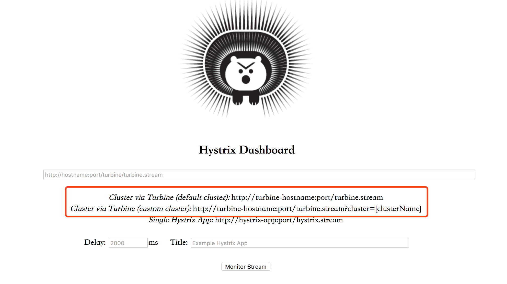

### 1.Hystrix 熔断器

分布式系统中服务与服务之间依赖错综复杂，当某个服务出现故障时，会导致调用其服务的其他服务出现远程调度的线程阻塞。
**这也意味着你要把处理错误的代码当成正常功能的代码来处理**

Hystrix 是Netflix公司是通过隔离服务的访问点阻止联动故障的，并提供了故障解决方案，从而提高了整个分布式系统的弹性。

Hystrix 
1. 提供快速失败机制
2. 提供回退 fallback 方案
3. 使用熔断机制，防止故障扩散到其他服务
4. 监控组件 Hystrix Dashboard ，可以使用Turbine聚合监控


SpringCloud Feign中Hystrix的使用
在 consul-client上 pom.xml 中添加
```xml
<dependency>
    <groupId>org.springframework.cloud</groupId>
    <artifactId>spring-cloud-starter-netflix-hystrix</artifactId>
</dependency>
```

application.yml
```yaml

feign:
  hystrix:
    enabled: true # 开启Feign熔断
```

修改Feign RemoteService接口,添加fallback 快速失败回调类

@FeignClient(value = "consul-server",fallback = HystrixClientFallback.class)

```java

@Component
public class HystrixClientFallback implements RemoteService{

    @Override
    public String api(String api) {
        return "Hystrix fallback ...";
    }
}
```

启动 consul-server,consul-client ,访问:http://localhost:8053/api/ 

停掉 consul-server 在访问 得到   Hystrix fallback ... 


####  2.使用tuibine 聚合监控

Hystrix Dashboard 监控服务的熔断器情况时，最多只有一个Hystrix Dashboard 主页，服务数量很多时，很不方便。

tuibine 可以监控多个Hystrix Dashboard主页，集中进行监控

**我们使用的是consul作为注册中心，而tuibine默认是使用eureka作为注册中心，不把eureka排除的话会报
Field registration in o.s.c.c.s.ServiceRegistryAutoConfiguration$ServiceRegistryEndpointConfiguration required a single bean, but 2 were found:
类似于这个https://github.com/spring-cloud/spring-cloud-netflix/issues/1973**


pom.xml 

```xml
<dependency>
    <groupId>org.springframework.cloud</groupId>
    <artifactId>spring-cloud-starter-netflix-hystrix</artifactId>
</dependency>
<dependency>
    <groupId>org.springframework.cloud</groupId>
    <artifactId>spring-cloud-starter-netflix-hystrix-dashboard</artifactId>
</dependency>
<dependency>
    <groupId>org.springframework.cloud</groupId>
    <artifactId>spring-cloud-starter-netflix-turbine</artifactId>
    <exclusions>
        <exclusion>
            <groupId>org.springframework.cloud</groupId>
            <artifactId>spring-cloud-starter-netflix-eureka-client</artifactId>
        </exclusion>
    </exclusions>
</dependency>

<dependency>
    <groupId>org.springframework.cloud</groupId>
    <artifactId>spring-cloud-starter-consul-discovery</artifactId>
</dependency>
```

Application.java 启动类 添加注解
```java
@SpringBootApplication
@EnableDiscoveryClient
@EnableHystrixDashboard
@EnableTurbine
@EnableHystrix
public class HystrixDashboardTurbineApplication {

	public static void main(String[] args) {
		SpringApplication.run(HystrixDashboardTurbineApplication.class, args);
	}
}

```

application.yml
```yaml
server:
  port: 8504
spring:
  cloud:
    consul:
      discovery:
        health-check-path: /actuator/health
        health-check-interval: 10s
        instance-id: ${spring.application.name}:${vcap.application.instance_id:${spring.application.instance_id:${random.value}}}
        service-name: ${spring.application.name}
      host: localhost
      port: 8500

  application:
    name: hystrix-turbine
#  boot:
#    admin:
#      client:
#        url: http://localhost:8700

# spring admin
#management:
#  endpoints:
#    web:
#      exposure:
#        include: "*"
#  endpoint:
#      health:
#        show-details: ALWAYS

turbine:
  aggregator:
    cluster-config: default     #需要监控的服务集群名
  app-config: consul-client    #需要监控的服务名
  cluster-name-expression: new String('default')
#  instanceUrlSuffix:
#      default: actuator/hystrix.stream    #key是clusterConfig集群的名字，value是hystrix监控的后缀，springboot2.0为actuator/hystrix.stream
```

启动后访问:

http://localhost:8504/hystrix
可以看到


填写
http://localhost:8504/turbine.stream ，monitor，开始进去可能没有数据

http://localhost:8504/hystrix/monitor?stream=http%3A%2F%2Flocalhost%3A8504%2Fturbine.stream%20


只启动两个 client 端

java -jar target/consul-client-0.0.1-SNAPSHOT.jar --server.port=8503

java -jar target/consul-client-0.0.1-SNAPSHOT.jar --server.port=8505

访问http://localhost:8505/api/ 或者 http://localhost:8503/api/  都行，多访问几次

就会得到,其中右下角4代表失败次数，Hosts=2代表集群有2个应用


